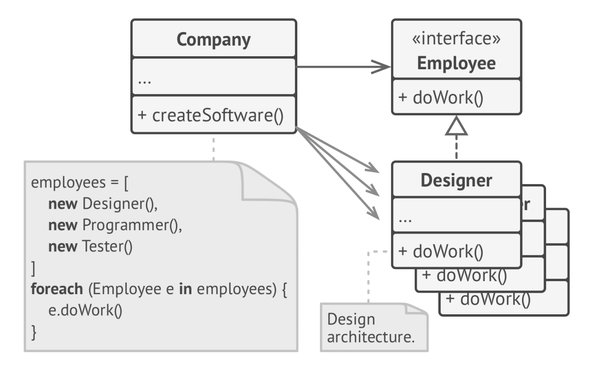

# Ch01 Basics of OOP

## UML example


* Data stored inside the object’s fields is often referenced
  as state, and all the object’s methods define its behavior.


# Ch02 Pillars of OOP

Four pillars:

* Abstraction
* Encapsulation
* Polymorphism
* Inheritance

## Abstraction

Your objects only model attributes and behaviors of
real objects in a specific context, ignoring the rest.

For example, an Airplane class could probably exist in both
a flight simulator and a flight booking application. But in the
former case, it would hold details related to the actual flight,
whereas in the latter class you would care only about the seat
map and which seats are available.

Abstraction is a model of a real-world object or phenomenon, limited to a specific context, which represents all details relevant to this context with high accuracy and omits all the rest.

所谓的抽象化过程，就是把事物的一方面特征，你所关心的特征拿出来，精确描述。然后忽略其余细节。


## Encapsulation

To drive a car, you only have very simple interface:

* a start switch
* a steering wheel
* some pedals

This illustrates how each object has an ***interface***—a public part of an object, open to interactions
with other objects.

***Encapsulation*** is the ability of an object to hide parts of its state and behaviors from other objects, exposing only a limited interface to the rest of the program.

In modern PL, the mechanism of interface (usually declared with `interface` or `protocol` keywords) lets you define contracts of interaction between objects. That's one of the reasons why the interface only cares about behaviours of objects, and why you can't declare a field in an interface.

Example: `Airport` class can only work with objects that implements `FlyingTransport` interface.

```java
public interface FlyingTransport {
    void fly(String origin, String destination, Integer passengers);
}

public class Airport {
  void accept(FlyingTransport vehicle);
}

public class Helicopter implements FlyingTransport {
  ...
}

public class Airplane implements FlyingTransport {
  ...
}
```


## Inheritance

***Inheritance*** is the ability to build new classes on top of existing ones. The main benefit of inheritance is code reuse.

The consequence of using inheritance is that subclasses have the same interface as their parent class.

* You can’t hide a method in a subclass if it was declared in the superclass. 
* You must also implement all abstract methods, even if they don’t make sense for your subclass.

这是继承不太flexible的地方。


In most PL, a subclass can only extend one super class. Any class can implement several interfaces at the same time.

## Polymorphism


想象我们从一个袋子里闭着眼睛拿动物，我们把动物弄出声音，他们就会发出各自的声音。我们就知道是猫还是狗了。


```java
bag = [new Cat(), new Dog()]
foreach (Animal a : bag)
  a.makeSound()
```


***Polymorphism*** is the ability of a program to detect the real class of an object and call its implementation even when its real type is unknown in the current context.

You can also think of polymorphism as the ability of an object to “pretend” to be something else, usually a class it extends or an interface it implements. In our example, the dogs and cats in the bag were pretending to be generic animals.

# Ch03 Relations Between Objects

Pg 20

如题，这章讲述class之间的其他关系。

## Association

***Association***: is a type of relationship in which one object uses or interacts with another.


The link between the 2 class is ***always*** there. It is similar to a field in a class, but doesn't always have to be. It can be a method that returns a object, e.g. an order have a method to return its customer.

注意这里的重点是***link is always there***.

## Dependency

***Dependency***: a weaker variant of association that usually implies that there’s no permanent link between objects.

Dependency typically (but not always) implies that an object accepts another object as a method parameter, instantiates, or uses another object.

比association宽泛，比如在一个method里作为参数。或者在一个method里，instantiates另一个类。这里method结束了，另一个class object就没有了。

Here’s how you can spot a dependency between classes: **a dependency exists between two classes if changes to the definition of one class result in modifications in another class.**


## Composition

***Composition***: "whole-part" relationship between two objects, one of which is composed of one or more instances of the other.

The distinction between this relation and others is that the component can only exist as a part of the container.

如下图，没有学校就没有系。


## Aggregation

***Aggregation***: One object merely contains a reference to another. The container doesn’t control the life cycle of the component. The component can exist without the container and can be linked to several containers at the same time.

没有了系，老师这个类还可以存在。可以换一个学校等等。


# Ch04 What's a Design Pattern

pg 25

***Design patterns***: common solutions to typical problems. They are customizable blueprints to solve recurring design problems in your code.

是一个像设计蓝图一样的东西。

You cannot use it the way you use off-the-shelf functions and libraries. They are a general concept for solving a particular problem. 

Pattern and Algorithm: both are typical solutions for some known problems.

* Algorithm: low level, a clear set of actions that can achieve some goal.
  * More like recipe, clear steps to achieve a goal.
* Pattern: high level description of a solution.
  * More like blueprint: what the result and its features are, but the exact order of information is up to you.

## What does the pattern consist of?

***Intent***: of the pattern briefly describes both the problem and the solution.

***Motivation***: further explains the problem and the solution the pattern makes possible.

***Structure*** of classes shows each part of the pattern and how they are related.

***Code example*** in one of the popular programming languages makes it easier to grasp the idea behind the pattern.

## Classification of patterns

Design patterns differ by their complexity, level of detail and scale of applicability to the entire system being designed.

Road construction analogy, to make a safe intersection:

* simple traffic lights
* multilevel Interchange, underground passages for pedestrians.

Low level patterns are called ***idioms***. Only to a single PL. 我们常说的pythonic way。

Most universal and high-level patterns are ***architectural patterns***.

***Creational patterns***: provide object creation mechanisms that increase flexibility and reuse of existing code.

***Structural patterns***: explain how to assemble objects and classes into larger structures, while keeping the structures flexible and efficient.

***Behavioral patterns***: take care of effective communication and the assignment of responsibilities between objects.

分别是object如何创建，如何放在一起，如果互动/各司其职。

# Ch05 Why Should I Learn Patterns?

pg 29

Design patterns are a toolkit of tried and tested solutions to common problems in software design. Even if you never encounter these problems, knowing patterns is still useful because it teaches you how to solve all sorts of problems using principles of object-oriented design.

Design patterns define a common language that you and your teammates can use to communicate more efficiently.

# Ch06 Features of Good Design

pg 31

This chapter discusses things to aim for and things to avoid in designing SW architecture.

## Code Reuse

We always want to reduce cost and development time.

Making existing code work in a new context usually takes extra effort.

Things that reduce flexibility and make it harder to reuse:

* Tight coupling between components
* dependencies on concrete classes instead of interfaces
* hardcoded operations

Using design patterns is one way to increase flexibility and make is easier to reuse. But sometimes make the components more complicated.

Erich Gamma's three levels of reuse:

* lowest level: class libraries, containers.
* highest level: Frameworks.
  * They identify the key abstractions for solving a problem, represent them by classes and define relations between them.
  * `JUnit` is a small framework, it only has `Test`, `TestCase` and `TestSuite` and relationships defined.
  * You hook into frameworks by subclassing somewhere. They use so-called Hollywood principle of "don't call us, we will call you".
  * The framework lets you define your custom behaviour and it will call you when it's your turn to do something.
  * 想想Juit和Springboot都是这样的。
* middle level: patterns.
  * smaller and more abstract than frameworks.
  * Describe how a couple of classes can relate to and interact with each other.
  * Less risky than frameworks, which needs lots of investment.
  * Let you reuse design ideas and concepts independently of concrete code.

The code reuse increases when moving from classes to patterns to frameworks.

## Extensibility

***Change*** is the only constant thing in a programmer’s life. There are several reasons why this happens.

* We understand better when we start to solve it.
* Sth. beyond your control happened. E.g. browser drops support for Flash.
* Customers need more features.

That’s why all seasoned developers try to provide for possible future changes when designing an application’s architecture.

# Ch07 Encapsulate What Varies

pg 35

***Identify the aspects of your application that vary and separate them from what stays the same.***

开船的比喻。水里有鱼雷，把船仓分割成一个一个房间。撞上一个鱼雷，一个房间进水了，别的房间没事。所以船不会沉。

Isolate the parts of the program that vary in independent modules, protecting the rest of the code
from adverse effects.

## Encapsulation on a method level

E.g., e-commerce app, we have `getOrderTotal` which calculates the grand total of the order including the tax. 税的计算会根据税法，地域做调整。所以会经常发生改变。

BEFORE: tax calculation code is mixed with the rest of the method’s code.

```java
1 method getOrderTotal(order) is
2 	total = 0
3 	foreach item in order.lineItems
4 		total += item.price * item.quantity
5
6 	if (order.country == "US")
7 		total += total * 0.07 // US sales tax
8 	else if (order.country == "EU"):
9 		total += total * 0.20 // European VAT
10
11  return total
```

AFTER: you can get the tax rate by calling a designated method.

```java
1 method getOrderTotal(order) is
2 	total = 0
3 	foreach item in order.lineItems
4 		total += item.price * item.quantity
5
6 	total += total * getTaxRate(order.country)
7
8 	return total
9
10 method getTaxRate(country) is
11 	if (country == "US")
12 		return 0.07 // US sales tax
13 	else if (country == "EU")
14 		return 0.20 // European VAT
15 	else
16 		return 0
```

## Encapsulation on a class level

Overtime you add more responsibilities to a method.

They blur the primary responsibility of the containing class.

BEFORE: calculating tax in Order class.


AFTER: tax calculation is hidden from the order class.


# Ch08 Program to an Interface, not an Implementation

pg 40

***Program to an interface, not an implementation. Depend on abstractions, not on concrete classes.***

You can tell that the design is flexible enough if you can easily extend it without breaking any existing code.

A `Cat` that can eat any food is more flexible than one that can eat just sausages. You can still feed the first cat with sausages because they are a subset of “any food”; however, you can extend that cat’s menu with any other food.

A flexible way to set up collaboration between objects:

1. Determine what exactly one object needs from the other: which methods does it execute?
2. Describe these methods in a new interface or abstract class.
3. Make the class that is a dependency implement this interface.
4. Now make the second class dependent on this interface rather than on the concrete class. You still can make it work with objects of the original class, but the connection is now much more flexible.


Before and after extracting the interface. The code on the right is more flexible than the code on the left, but it’s also more complicated.

## Another Example

### Implementation 1

BEFORE: all classes are tightly coupled. Note in the `createSw` function, all concrete classes are instantiated.


### Implementation 2

虽然每一个工种做的事情不一样，但是我们可以把generalize various work-related methods and then extract a common interface for all employee classes.



Here, we use polymorphsm. Now the `Company` can treat different employee objects via `Employee` interface.

BETTER: polymorphism helped us simplify the code, but the rest of the Company class still depends on the concrete employee classes.

### Implementation 3

上一个解法的问题，如果我们要有不同类型的公司，每个公司里有不同类型的员工。我们岂不是要定义不同的公司类？

To solve this problem, we could declare the method for getting employees as abstract. Each concrete company will implement this method differently, creating only those employees that it needs.

AFTER: the primary method of the Company class is independent from concrete employee classes. Employee objects are created in concrete company subclasses.

Now you can extend this class and introduce new types of companies and employees while still reusing a portion of the base company class.


# Ch09 Favor Composition Over Inheritance

pg 45

继承是最直接的code reuse的方法。两个类有相同的code，创建一个common base class, move the similar code into it。划算！

但是如果程序变大，tons of classes会有以下问题。

* ***A subclass can’t reduce the interface of the superclass.*** You have to implement all abstract methods of the parent class even if you won’t be using them. 这点在第二章讲到继承的时候也提到了。
* ***When overriding methods you need to make sure that the new behavior is compatible with the base one.*** It’s important because objects of the subclass may be passed to any code that expects objects of the superclass and you don’t want that code to break. 程序如果打了，可能有无数的地方会用到base class。这很难保证overriding methods不break。
* ***Inheritance breaks encapsulation of the superclass*** because the internal details of the parent class become available to the subclass. There might be an opposite situation where a programmer makes a superclass aware of some details of subclasses for the sake of making further extension easier. 如果有例子就好了。
* ***Subclasses are tightly coupled to superclasses***. Any change in a superclass may break the functionality of subclasses.
* ***Trying to reuse code through inheritance can lead to creating parallel inheritance hierarchies.*** Inheritance usually takes place in a single dimension. But whenever there are two or more dimensions, you have to create lots of class combinations, bloating the class hierarchy to a ridiculous size. 看这一章的例子。

更好的做法是composition. Whereas inheritance represents the “is a” relationship between classes (a car is a transport), composition represents the “has a” relationship (a car has an engine). Composition的定义参考第三章。

这条principle也适用于aggregation—a more relaxed variant of composition where one object may have a reference to the other one but doesn’t manage its lifecycle. Here’s an example: a car has a driver, but he or she may use another car or just walk without the car. Aggregation的定义也参考第三章。

## Example

***Inheritance implementation***: extending a class in several dimensions (cargo type × engine type × navigation type) may lead to a combinatorial explosion of subclasses.

Each additional parameter results in multiplying the number of subclasses. There’s a lot of duplicate code between subclasses because a subclass can’t extend two classes at the same time.


***Composition implementation***: delegate a behavior of a car to other objects. This way, you can replace a behavior at run-time. For instance, you can replace an engine object linked to a car object just by assigning a different engine object to the car.

 在这张图里，`engine`和`driver`都是`Transport`的一个filed。Because no transport no engine, this is a composition. `Driver` and `Transport` has different lifecycle, so it's an association.

COMPOSITION: different “dimensions” of functionality extracted to their own class hierarchies. 所以class的数目不会爆炸，只会线性增长。

This structure of classes resembles the ***Strategy*** pattern, which we’ll go over later in this book.


# Part 3.1 SOLID Principles

pg 49

Coined by Robert C. Martin. SOLID principles make software designs more understandable, flexible and maintainable.

实际应用中，不可能会把所有的这5条都用上。要根据实际情况，不要教条主义。

# Ch10 Single Responsibility Principle

Pg 50

***A class should have just one reason to change.***

Try to make every class responsible for a single part of the functionality provided by the software, and make that responsibility entirely encapsulated by (you can also say hidden within) the class.

如果程序只有200行，没必要。主要是程序可能越来越大，越来越难理解。第二点，要是class变的太大，每次要改东西，就可能会breaking other parts of the class which you didn’t even intend to change.

If you feel that it’s becoming hard to focus on specific aspects of the program one at a time, remember the single responsibility principle and check whether it’s time to divide some classes into parts.

## 10.1 Example

比如我有一个`Employee`class，其中有个`printTimeSheetReport()`的函数，可能time sheet的形式一直会变化，所以这个函数一直要变。

BEFORE: the class contains several different behaviors.


AFTER: the extra behavior is in its own class. 我们把`TimeSheetReport` 单独做成以个类，就不用改`Employee`class了。


# Ch11Open/Closed Principle

pg 51

***Classes should be open for extension but closed for modification.***


[TOC]

