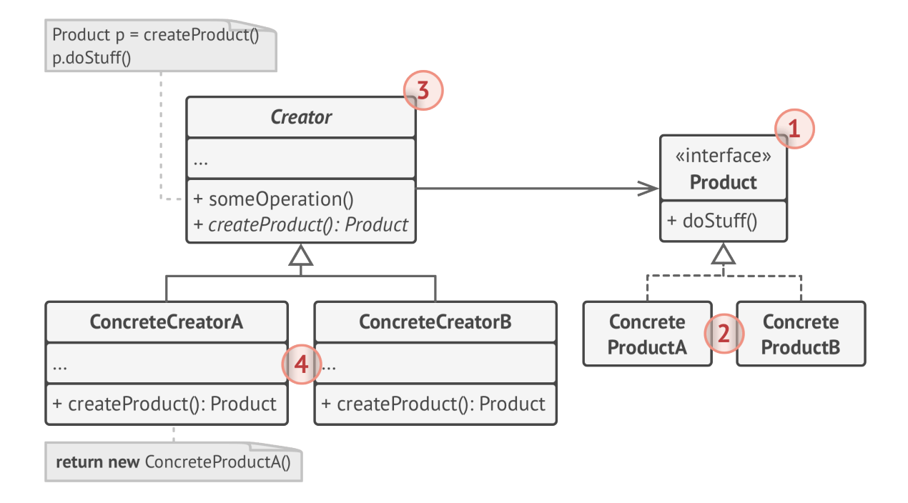

# Ch01 Basics of OOP

## UML example


* Data stored inside the object’s fields is often referenced
  as state, and all the object’s methods define its behavior.


# Ch02 Pillars of OOP

Four pillars:

* Abstraction
* Encapsulation
* Polymorphism
* Inheritance

## Abstraction

Your objects only model attributes and behaviors of
real objects in a specific context, ignoring the rest.

For example, an Airplane class could probably exist in both
a flight simulator and a flight booking application. But in the
former case, it would hold details related to the actual flight,
whereas in the latter class you would care only about the seat
map and which seats are available.

Abstraction is a model of a real-world object or phenomenon, limited to a specific context, which represents all details relevant to this context with high accuracy and omits all the rest.

所谓的抽象化过程，就是把事物的一方面特征，你所关心的特征拿出来，精确描述。然后忽略其余细节。


## Encapsulation

To drive a car, you only have very simple interface:

* a start switch
* a steering wheel
* some pedals

This illustrates how each object has an ***interface***—a public part of an object, open to interactions
with other objects.

***Encapsulation*** is the ability of an object to hide parts of its state and behaviors from other objects, exposing only a limited interface to the rest of the program.

In modern PL, the mechanism of interface (usually declared with `interface` or `protocol` keywords) lets you define contracts of interaction between objects. That's one of the reasons why the interface only cares about behaviours of objects, and why you can't declare a field in an interface.

Example: `Airport` class can only work with objects that implements `FlyingTransport` interface.

```java
public interface FlyingTransport {
    void fly(String origin, String destination, Integer passengers);
}

public class Airport {
  void accept(FlyingTransport vehicle);
}

public class Helicopter implements FlyingTransport {
  ...
}

public class Airplane implements FlyingTransport {
  ...
}
```


## Inheritance

***Inheritance*** is the ability to build new classes on top of existing ones. The main benefit of inheritance is code reuse.

The consequence of using inheritance is that subclasses have the same interface as their parent class.

* You can’t hide a method in a subclass if it was declared in the superclass. 
* You must also implement all abstract methods, even if they don’t make sense for your subclass.

这是继承不太flexible的地方。


In most PL, a subclass can only extend one super class. Any class can implement several interfaces at the same time.

## Polymorphism


想象我们从一个袋子里闭着眼睛拿动物，我们把动物弄出声音，他们就会发出各自的声音。我们就知道是猫还是狗了。


```java
bag = [new Cat(), new Dog()]
foreach (Animal a : bag)
  a.makeSound()
```


***Polymorphism*** is the ability of a program to detect the real class of an object and call its implementation even when its real type is unknown in the current context.

You can also think of polymorphism as the ability of an object to “pretend” to be something else, usually a class it extends or an interface it implements. In our example, the dogs and cats in the bag were pretending to be generic animals.

# Ch03 Relations Between Objects

Pg 20

如题，这章讲述class之间的其他关系。

## Association

***Association***: is a type of relationship in which one object uses or interacts with another.


The link between the 2 class is ***always*** there. It is similar to a field in a class, but doesn't always have to be. It can be a method that returns a object, e.g. an order have a method to return its customer.

注意这里的重点是***link is always there***.

## Dependency

***Dependency***: a weaker variant of association that usually implies that there’s no permanent link between objects.

Dependency typically (but not always) implies that an object accepts another object as a method parameter, instantiates, or uses another object.

比association宽泛，比如在一个method里作为参数。或者在一个method里，instantiates另一个类。这里method结束了，另一个class object就没有了。

Here’s how you can spot a dependency between classes: **a dependency exists between two classes if changes to the definition of one class result in modifications in another class.**


## Composition

***Composition***: "whole-part" relationship between two objects, one of which is composed of one or more instances of the other.

The distinction between this relation and others is that the component can only exist as a part of the container.

如下图，没有学校就没有系。


## Aggregation

***Aggregation***: One object merely contains a reference to another. The container doesn’t control the life cycle of the component. The component can exist without the container and can be linked to several containers at the same time.

没有了系，老师这个类还可以存在。可以换一个学校等等。


# Ch04 What's a Design Pattern

pg 25

***Design patterns***: common solutions to typical problems. They are customizable blueprints to solve recurring design problems in your code.

是一个像设计蓝图一样的东西。

You cannot use it the way you use off-the-shelf functions and libraries. They are a general concept for solving a particular problem. 

Pattern and Algorithm: both are typical solutions for some known problems.

* Algorithm: low level, a clear set of actions that can achieve some goal.
  * More like recipe, clear steps to achieve a goal.
* Pattern: high level description of a solution.
  * More like blueprint: what the result and its features are, but the exact order of information is up to you.

## What does the pattern consist of?

***Intent***: of the pattern briefly describes both the problem and the solution.

***Motivation***: further explains the problem and the solution the pattern makes possible.

***Structure*** of classes shows each part of the pattern and how they are related.

***Code example*** in one of the popular programming languages makes it easier to grasp the idea behind the pattern.

## Classification of patterns

Design patterns differ by their complexity, level of detail and scale of applicability to the entire system being designed.

Road construction analogy, to make a safe intersection:

* simple traffic lights
* multilevel Interchange, underground passages for pedestrians.

Low level patterns are called ***idioms***. Only to a single PL. 我们常说的pythonic way。

Most universal and high-level patterns are ***architectural patterns***.

***Creational patterns***: provide object creation mechanisms that increase flexibility and reuse of existing code.

***Structural patterns***: explain how to assemble objects and classes into larger structures, while keeping the structures flexible and efficient.

***Behavioral patterns***: take care of effective communication and the assignment of responsibilities between objects.

分别是object如何创建，如何放在一起，如果互动/各司其职。

# Ch05 Why Should I Learn Patterns?

pg 29

Design patterns are a toolkit of tried and tested solutions to common problems in software design. Even if you never encounter these problems, knowing patterns is still useful because it teaches you how to solve all sorts of problems using principles of object-oriented design.

Design patterns define a common language that you and your teammates can use to communicate more efficiently.

# Ch06 Features of Good Design

pg 31

This chapter discusses things to aim for and things to avoid in designing SW architecture.

## Code Reuse

We always want to reduce cost and development time.

Making existing code work in a new context usually takes extra effort.

Things that reduce flexibility and make it harder to reuse:

* Tight coupling between components
* dependencies on concrete classes instead of interfaces
* hardcoded operations

Using design patterns is one way to increase flexibility and make is easier to reuse. But sometimes make the components more complicated.

Erich Gamma's three levels of reuse:

* lowest level: class libraries, containers.
* highest level: Frameworks.
  * They identify the key abstractions for solving a problem, represent them by classes and define relations between them.
  * `JUnit` is a small framework, it only has `Test`, `TestCase` and `TestSuite` and relationships defined.
  * You hook into frameworks by subclassing somewhere. They use so-called Hollywood principle of "don't call us, we will call you".
  * The framework lets you define your custom behaviour and it will call you when it's your turn to do something.
  * 想想Juit和Springboot都是这样的。
* middle level: patterns.
  * smaller and more abstract than frameworks.
  * Describe how a couple of classes can relate to and interact with each other.
  * Less risky than frameworks, which needs lots of investment.
  * Let you reuse design ideas and concepts independently of concrete code.

The code reuse increases when moving from classes to patterns to frameworks.

## Extensibility

***Change*** is the only constant thing in a programmer’s life. There are several reasons why this happens.

* We understand better when we start to solve it.
* Sth. beyond your control happened. E.g. browser drops support for Flash.
* Customers need more features.

That’s why all seasoned developers try to provide for possible future changes when designing an application’s architecture.

# Ch07 Encapsulate What Varies

pg 35

***Identify the aspects of your application that vary and separate them from what stays the same.***

开船的比喻。水里有鱼雷，把船仓分割成一个一个房间。撞上一个鱼雷，一个房间进水了，别的房间没事。所以船不会沉。

Isolate the parts of the program that vary in independent modules, protecting the rest of the code
from adverse effects.

## Encapsulation on a method level

E.g., e-commerce app, we have `getOrderTotal` which calculates the grand total of the order including the tax. 税的计算会根据税法，地域做调整。所以会经常发生改变。

BEFORE: tax calculation code is mixed with the rest of the method’s code.

```java
1 method getOrderTotal(order) is
2 	total = 0
3 	foreach item in order.lineItems
4 		total += item.price * item.quantity
5
6 	if (order.country == "US")
7 		total += total * 0.07 // US sales tax
8 	else if (order.country == "EU"):
9 		total += total * 0.20 // European VAT
10
11  return total
```

AFTER: you can get the tax rate by calling a designated method.

```java
1 method getOrderTotal(order) is
2 	total = 0
3 	foreach item in order.lineItems
4 		total += item.price * item.quantity
5
6 	total += total * getTaxRate(order.country)
7
8 	return total
9
10 method getTaxRate(country) is
11 	if (country == "US")
12 		return 0.07 // US sales tax
13 	else if (country == "EU")
14 		return 0.20 // European VAT
15 	else
16 		return 0
```

## Encapsulation on a class level

Overtime you add more responsibilities to a method.

They blur the primary responsibility of the containing class.

BEFORE: calculating tax in Order class.


AFTER: tax calculation is hidden from the order class.


# Ch08 Program to an Interface, not an Implementation

pg 40

***Program to an interface, not an implementation. Depend on abstractions, not on concrete classes.***

You can tell that the design is flexible enough if you can easily extend it without breaking any existing code.

A `Cat` that can eat any food is more flexible than one that can eat just sausages. You can still feed the first cat with sausages because they are a subset of “any food”; however, you can extend that cat’s menu with any other food.

A flexible way to set up collaboration between objects:

1. Determine what exactly one object needs from the other: which methods does it execute?
2. Describe these methods in a new interface or abstract class.
3. Make the class that is a dependency implement this interface.
4. Now make the second class dependent on this interface rather than on the concrete class. You still can make it work with objects of the original class, but the connection is now much more flexible.


Before and after extracting the interface. The code on the right is more flexible than the code on the left, but it’s also more complicated.

## Another Example

### Implementation 1

BEFORE: all classes are tightly coupled. Note in the `createSw` function, all concrete classes are instantiated.


### Implementation 2

虽然每一个工种做的事情不一样，但是我们可以把generalize various work-related methods and then extract a common interface for all employee classes.


Here, we use polymorphsm. Now the `Company` can treat different employee objects via `Employee` interface.

BETTER: polymorphism helped us simplify the code, but the rest of the Company class still depends on the concrete employee classes.

### Implementation 3

上一个解法的问题，如果我们要有不同类型的公司，每个公司里有不同类型的员工。我们岂不是要定义不同的公司类？

To solve this problem, we could declare the method for getting employees as abstract. Each concrete company will implement this method differently, creating only those employees that it needs.

AFTER: the primary method of the Company class is independent from concrete employee classes. Employee objects are created in concrete company subclasses.

Now you can extend this class and introduce new types of companies and employees while still reusing a portion of the base company class.


# Ch09 Favor Composition Over Inheritance

pg 45

继承是最直接的code reuse的方法。两个类有相同的code，创建一个common base class, move the similar code into it。划算！

但是如果程序变大，tons of classes会有以下问题。

* ***A subclass can’t reduce the interface of the superclass.*** You have to implement all abstract methods of the parent class even if you won’t be using them. 这点在第二章讲到继承的时候也提到了。
* ***When overriding methods you need to make sure that the new behavior is compatible with the base one.*** It’s important because objects of the subclass may be passed to any code that expects objects of the superclass and you don’t want that code to break. 程序如果打了，可能有无数的地方会用到base class。这很难保证overriding methods不break。
* ***Inheritance breaks encapsulation of the superclass*** because the internal details of the parent class become available to the subclass. There might be an opposite situation where a programmer makes a superclass aware of some details of subclasses for the sake of making further extension easier. 如果有例子就好了。
* ***Subclasses are tightly coupled to superclasses***. Any change in a superclass may break the functionality of subclasses.
* ***Trying to reuse code through inheritance can lead to creating parallel inheritance hierarchies.*** Inheritance usually takes place in a single dimension. But whenever there are two or more dimensions, you have to create lots of class combinations, bloating the class hierarchy to a ridiculous size. 看这一章的例子。

更好的做法是composition. Whereas inheritance represents the “is a” relationship between classes (a car is a transport), composition represents the “has a” relationship (a car has an engine). Composition的定义参考第三章。

这条principle也适用于aggregation—a more relaxed variant of composition where one object may have a reference to the other one but doesn’t manage its lifecycle. Here’s an example: a car has a driver, but he or she may use another car or just walk without the car. Aggregation的定义也参考第三章。

## Example

***Inheritance implementation***: extending a class in several dimensions (cargo type × engine type × navigation type) may lead to a combinatorial explosion of subclasses.

Each additional parameter results in multiplying the number of subclasses. There’s a lot of duplicate code between subclasses because a subclass can’t extend two classes at the same time.


***Composition implementation***: delegate a behavior of a car to other objects. This way, you can replace a behavior at run-time. For instance, you can replace an engine object linked to a car object just by assigning a different engine object to the car.

 在这张图里，`engine`和`driver`都是`Transport`的一个filed。Because no transport no engine, this is a composition. `Driver` and `Transport` has different lifecycle, so it's an association.

COMPOSITION: different “dimensions” of functionality extracted to their own class hierarchies. 所以class的数目不会爆炸，只会线性增长。

This structure of classes resembles the ***Strategy*** pattern, which we’ll go over later in this book.


# Part 3.1 SOLID Principles

pg 49

Coined by Robert C. Martin. SOLID principles make software designs more understandable, flexible and maintainable.

实际应用中，不可能会把所有的这5条都用上。要根据实际情况，不要教条主义。

# Ch10 Single Responsibility Principle

Pg 50

***A class should have just one reason to change.***

Try to make every class responsible for a single part of the functionality provided by the software, and make that responsibility entirely encapsulated by (you can also say hidden within) the class.

如果程序只有200行，没必要。主要是程序可能越来越大，越来越难理解。第二点，要是class变的太大，每次要改东西，就可能会breaking other parts of the class which you didn’t even intend to change.

If you feel that it’s becoming hard to focus on specific aspects of the program one at a time, remember the single responsibility principle and check whether it’s time to divide some classes into parts.

## 10.1 Example

比如我有一个`Employee`class，其中有个`printTimeSheetReport()`的函数，可能time sheet的形式一直会变化，所以这个函数一直要变。

BEFORE: the class contains several different behaviors.


AFTER: the extra behavior is in its own class. 我们把`TimeSheetReport` 单独做成以个类，就不用改`Employee`class了。


# Ch11 Open/Closed Principle

pg 51

***Classes should be open for extension but closed for modification.***

The main idea of this principle is to keep existing code from breaking when you implement new features.

A class is open if you can extend it, produce a subclass and do whatever you want with it—add new methods or fields, override base behavior, etc. Some programming languages let you restrict further extension of a class with special keywords, such as `final` . After this, the class is no longer open. At the same time, the class is closed (you can also say complete) if it’s 100% ready to be used by other classes—its interface is clearly defined and won’t be changed in the future.

如果一个class已经开发，测试完成，并且已经广泛应用了，那就不应该去修改它。应该去继承它，override它的原有功能。这样就不会break existing code。

除非知道class里有bug。

## 11.1 Example

Ecommerce example. BEFORE: you have to change the Order class whenever you add a new shipping method to the app.


Use *Strategy* pattern, similar to ch09 example. Start by extracting shipping methods into separate classes with a common interface. AFTER: adding a new shipping method doesn’t require changing existing classes.


Now when you need to implement a new shipping method, you can derive a new class from the Shipping interface without touching any of the Order class’ code. The client code of the Order class will link orders with a shipping object of the new class whenever the user selects this shipping methods in the UI.

# Ch12 Liskov Substitution Principle1

Pg 55

***When extending a class, remember that you should be able to pass objects of the subclass in place of objects of the parent class without breaking the client code.***

When overriding a method, extend the base behavior rather than replacing it with something else entirely.

The substitution principle is a set of checks that help predict whether a subclass remains compatible with the code that was able to work with objects of the superclass.

Unlike other design principles which are wide open for interpretation, the substitution principle has a set of formal requirements for subclasses, and specifically for their methods.

## Rule No. 1

***Parameter types in a method of a subclass should match or be more abstract than parameter types in the method of the superclass.***

```java
class A {
  // There’s a class with a method that’s supposed to feed cats
  // Client code always passes cat objects into this method.
  void feed(Cat c) {}
}

class AGood extends A {
  // a subclass that overrode the method so that it can feed
  // any animal (a superclass of cats).
  // if you pass an object of this subclass
  // instead of an object of the superclass to the client code,
  // everything would still work fine. The method can feed all
  // animals, so it can still feed any cat passed by the client.
  void feed(Animal c) {}
}

class ABad extends A {
  // created another subclass and restricted the
  // feeding method to only accept Bengal cats (a subclass of cats)
  // Since the method can only feed a specific breed of
  // cats, it won’t serve generic cats passed by the client,
  // breaking all related functionality.
  void feed(BengalCat c) {}
}
```

## Rule No. 2

***The return type in a method of a subclass should match or be a subtype of the return type in the method of the superclass.***

Requirements for a return type are inverse to requirements for parameter types.

```java
class A {
  // The client code expects to receive any cat as a result of executing this method.
  Cat buyCat() {}
}

class AGood extends A {
  // The client gets a Bengal cat, which is still a cat, so everything is okay.
  BengalCat buyCat() {}
}

class ABad extends A {
  // Now the client code breaks since it
	// receives an unknown generic animal (an alligator? a bear?)
	// that doesn’t fit a structure designed for a cat.
  Animal buyCat() {}
}
```

## Rule No. 3

***A method in a subclass shouldn’t throw types of exceptions which the base method isn’t expected to throw.***

In most modern programming languages, especially statically typed ones (Java, C#, and others), these rules are built into the language. You won’t be able to compile a program that violates these rules.

## Rule No. 4

***A subclass shouldn’t strengthen pre-conditions.***

比如父类函数只要求参数是整数，子类函数却要求参数是正整数，否则就扔异常。client code breaks.

## Rule No. 5

***Invariants of a superclass must be preserved.***

*Invariants* are conditions in which an object makes sense. For example, invariants of a cat are
having four legs, a tail, ability to meow, etc. 

The confusing part about invariants is that while they can be defined explicitly in the form of interface contracts or a set of assertions within methods, they could also be implied by certain unit tests and
expectations of the client code.

The rule on invariants is the easiest to violate because you might misunderstand or not realize all of the invariants of a complex class. 

Best practise. Therefore, the safest way to extend a class is to introduce new fields and methods, and not mess with any existing members of the superclass. Of course, that’s not always doable in real life.

## Rule No. 6

pg 59

***A subclass shouldn’t change values of private fields of the superclass.***

Some PL let you access private members of a class via reflection mechanisms.

Other languages (Python, JavaScript) don’t have any protection for the private members at all.

### Example

```java
class Project {
  private documents;
  public openAll() {
    foreach (doc in documents) {
      doc.open()
    }
  }
  public saveAll() {
    foreach (doc in documents) {
      if (!doc instanceof ReadOnlyDocument) {
        doc.save()
      }
    }
  }
}

class Document {
  private data;
  private filename;
  public open();
  public save();
}

class ReadOnlyDocument extends Document {
  public save() {
    throw new Exception("Can't save a read-only document.");
  }
}
```


The `save` method in the `ReadOnlyDocuments` subclass throws an exception if someone tries to call it. The base method doesn’t have this restriction. This means that the client code will break if we don’t check the document type before saving it.

The resulting code also violates the open/closed principle, since the client code becomes dependent on concrete classes of documents. If you introduce a new document subclass, you’ll need to change the client code to support it.

```java
class Project {
  private allDocs;
  private writableDocs;
  public openAll() {
    foreach (doc in allDocs) {
      doc.open()
    }
  }
  public saveAll() {
    foreach (doc in writableDocs) {
        doc.save()
    }
  }
}

class Document {
  private data;
  private filename;
  public open();
}

class WriteableDocument extends Document {
  public save();
}
```


You can solve the problem by redesigning the class hierarchy: a subclass should extend the behavior of a superclass, therefore the read-only document becomes the base class of the hierarchy. The writable document is now a subclass which extends the base class and adds the saving behavior.

# Ch13 Interface Segregation Principle

Pg 62

***Clients shouldn’t be forced to depend on methods they do not use.***

Try to make your interfaces narrow enough that client classes don’t have to implement behaviors they don’t need.

* break down “fat” interfaces into more granular and specific ones.
* Clients should implement only those methods that they really need.

Class can only have one superclass, but can implement multiple interfaces at the same time. No need to cram tons of unrelated methods into a single interface.

Break it down into several more refined interfaces.

## Example

You have a library to makes it easy to integrate apps with various cloud computing providers. Intially, you only have Amazon, then you added support for Dropbox. Dropbox doesn't need to support several features.

BEFORE: not all clients can satisfy the requirements of the bloated interface.


The better approach is to break down the interface into parts. Classes that are able to implement the original interface can now just implement several refined interfaces.

AFTER: one bloated interface is broken down into a set of more granular interfaces.


As with the other principles, you can go too far with this one. Don’t further divide an interface which is already quite specific. Remember that the more interfaces you create, the more complex your code becomes. Keep the balance.

# Ch14 Dependency Inversion Principle

Pg 65

***High-level classes shouldn’t depend on low-level classes. Both should depend on abstractions. Abstractions shouldn’t depend on details. Details should depend on abstractions.***

SW usually have 2 classes:

**Low-level** classes implement basic operations such as working with a disk, transferring data over a network, connecting to a database, etc.

**High-level** classes contain complex business logic that directs low-level classes to do something.

有时候大家先设计底层，因为根本不知道高层要做成什么样。这样设计高层的时候就会dependent on 底层。

建议分这样三步：

For starters, you need to describe interfaces for low-level operations that high-level classes rely on, preferably in business terms. For instance, business logic should call a method `openReport(file)` rather than a series of methods `openFile(x) , readBytes(n) , closeFile(x) `.

Now you can make high-level classes dependent on those interfaces, instead of on concrete low-level classes. This dependency will be much softer than the original one.

Once low-level classes implement these interfaces, they become dependent on the business logic level, reversing the direction of the original dependency.

The dependency inversion principle often goes along with the *open/closed principle*: you can extend low-level classes to use with different business logic classes without breaking existing classes.

## 14.1 Example

High-level reporting class uses a low-level database class for reading and persisting its data. When a new version of the database server gets released, may affect the high-level class.

BEFORE: a high-level class depends on a low-level class.


You can fix this problem by creating a high-level interface that describes read/write operations and making the reporting class use that interface instead of the low-level class.

Then you can change or extend the original low-level class to implement the new read/write interface declared by the business logic.

总之就是要先让high level把interface定好。

AFTER: low-level classes depend on a high-level abstraction.


As a result, the direction of the original dependency has been inverted: low-level classes are now dependent on high-level abstractions.

这话是关键，底层依赖高层。

# Creational Design Patterns

Pg 70

* Factory Method: Provides an interface for creating objects in a superclass, but allows subclasses to alter the type of objects that will be created.

# Ch15 Factory Method

Pg 72

Also known as: Virtual Constructor

**Factory Method**: is a creational design pattern that provides an interface for creating objects in a superclass, but allows subclasses to alter the type of objects that will be created.

## Problem

Logistics management app, first version only handles trunk transportation. So the bulk of your code lives inside the `Truck` class. 

Later, customer wants to incorporate sea logistics. Two problems we are facing:

* Adding `Ships` into the app would require making changes to the entire codebase.
* Moreover, if later you decide to add another type of transportation to the app, you will probably need to make all of these changes again.

## Solution

The Factory Method pattern suggests that you replace direct object construction calls (using the `new` operator) with calls to a special factory method. Don’t worry: the objects are still created via the `new` operator, but it’s being called from within the factory method. Objects returned by a factory method are
often referred to as “products.”

* Subclasses can alter the class of objects being returned by the factory method.


* In this example, `createTransport()` is the factory method. In base class, `createTransport` returns a `Transport` type.
* In subclass, the class of products can be changed.
* Some limitations with the factory method:
  * subclasses may return different types of products only if these products have a common base class or interface.
  * Also, the factory method in the base class should have its return type declared as this interface.
* As shown in the figure below, all products must follow the same interface.


* The code that uses the factory method (often called the client code) doesn’t see a difference between the actual products returned by various subclasses. The client treats all the products as abstract `Transport` .


所以整个APP的结构就经历了如下变化。


变身成


* 原本在client code里是 `Trunk` 的地方，都换成是 `Transport`. Then if add more types of `Transport`, as long as all product classes implement a common interface, the client code won't break.

## Structure

pg 76



1. The `Product` declares the interface, which is common to all objects that can be produced by the creator and its subclasses.
2. `Concrete Products` are different implementations of the product interface.
3. The `Creator` class declares the factory method that returns new product objects. It’s important that the return type of this method matches the product interface.
   1. You can either make factory method as abstract to force all subclasses to implement their own versions.
   2. Or the base factory method can return some default product type.
   3. Note product creation is not the primary responsibility of the creator. Usually, the creator class already has some core business logic related to products. The factory method helps to decouple this logic from the concrete product classes.
   4. Analogy: SW company have a training program, but its purpose is not to produce programmers.
4. `Concrete Creators` override the base factory method so it returns a different type of product.
   1. It can return an existing object from a cache, an object pool.

## Pseudocode


* Scenario: creating cross-platform UI elements without coupling the client code to concrete UI classes.
  * Under various operating systems, these elements may look a little bit different, but they should still behave consistently. A button in Windows is still a button in Linux.

* With factory method, you don’t need to rewrite the logic of the dialog for each OS.
* We declare a factory method that produces buttons inside the base dialog class.
  * Subclass returns Windows-styled button from the factory method.
  * Subclass inherits most of the dialog’s code from the base class.
* The base dialog class must work with abstract buttons.

```java
// The creator class declares the factory method that must
// return an object of a product class. The creator's subclasses
// usually provide the implementation of this method.
class Dialog is
  // The creator may also provide some default implementation
  // of the factory method.
  abstract method createButton()

  // Note that, despite its name, the creator's primary
  // responsibility isn't creating products. It usually
  // contains some core business logic that relies on product
  // objects returned by the factory method. Subclasses can
  // indirectly change that business logic by overriding the
  // factory method and returning a different type of product
  // from it.
  method render() is
    // Call the factory method to create a product object.
    Button okButton = createButton()
    // Now use the product.
    okButton.onClick(closeDialog)
    okButton.render()


// Concrete creators override the factory method to change the
// resulting product's type.
class WindowsDialog extends Dialog is
  method createButton() is
  return new WindowsButton()

class WebDialog extends Dialog is
  method createButton() is
  return new HTMLButton()


// The product interface declares the operations that all
// concrete products must implement.
interface Button is
  method render()
  method onClick(f)

// Concrete products provide various implementations of the
// product interface.
class WindowsButton implements Button is
  method render(a, b) is
  // Render a button in Windows style.
  method onClick(f) is
  // Bind a native OS click event.

class HTMLButton implements Button is
  method render(a, b) is
  // Return an HTML representation of a button.
  method onClick(f) is
  // Bind a web browser click event.


class Application is
  field dialog: Dialog

  // The application picks a creator's type depending on the
  // current configuration or environment settings.
  method initialize() is
  config = readApplicationConfigFile()

  if (config.OS == "Windows") then
    dialog = new WindowsDialog()
  else if (config.OS == "Web") then
    dialog = new WebDialog()
  else
    throw new Exception("Error! Unknown operating system.")

  // The client code works with an instance of a concrete
  // creator, albeit through its base interface. As long as
  // the client keeps working with the creator via the base
  // interface, you can pass it any creator's subclass.
  method main() is
    this.initialize()
    dialog.render()
```

## 💡Applicability

🐞 

* **Use the Factory Method when you don’t know beforehand the exact types and dependencies of the objects your code should work with.**

⚡

* The Factory Method separates product construction code from the code that actually uses the product. Therefore it’s easier to extend the product construction code independently from the rest of the code.
* To add a new product type to the app, you’ll only need to create a new creator subclass and override the factory method in it.

🐞

* **Use the Factory Method when you want to provide users of your library or framework with a way to extend its internal components.**

⚡

* Inheritance is probably the easiest way to extend the default behavior of a library or framework. But how would the framework recognize that your subclass should be used instead of a standard component?
* The solution is to reduce the code that constructs components across the framework into a single factory method and let anyone override this method in addition to extending the component itself.
* Use cases
  * Our app is using an open source UI framework. Your app needs round buttons, but the framework only has square ones.
  * We extend the standard `Button` class with a glorious `RoundButton` subclass.
  * We also extend the `UIFramework` with `UIWithRoundButtons` and override `createButton` and make it returns `RoundButton`.
  * Then we use `UIWithRoundButtons` class instead of  `UIFramework` class.

🐞

* **Use the Factory Method when you want to save system resources by reusing existing objects instead of rebuilding them each time.**

⚡

* Sometimes we are dealing with large, resource-intensive objects such as database connections, file systems, and network resources. Here is what has to be done to reuse an existing object:
  * First, you need to create some storage to keep track of all of the created objects.
  * When someone requests an object, the program should look for a free object inside that pool.
  * then return it to the client code.
  * If there are no free objects, the program should create a new one (and add it to the pool).
* It's reasonable to put this code into the constructor of the class whose objects we’re trying to reuse. However, a constructor must always return **new objects** by definition. It can’t return existing
  instances.
* We need to have a regular method capable of creating new objects as well as reusing existing ones. That sounds very much like a factory method.

## 📝 How to Implement

  1. Make all products follow the same interface. This interface should declare methods that make sense in every product.
  2. Add an empty factory method inside the creator class. The return type of the method should match the common product interface.
  3. In the creator’s code find all references to product constructors. One by one, replace them with calls to the factory method, while extracting the product creation code into the factory method.
          1. You might need to add a temporary parameter to the factory method to control the type of returned product.
        2. the code of the factory method may look pretty ugly. It may have a large `switch` operator that picks which product class to instantiate.
 4. Now, create a set of creator subclasses for each type of product listed in the factory method. Override the factory method in the subclasses and extract the appropriate bits of construction code from the base method.
 5. If there are too many product types and it doesn’t make sense to create subclasses for all of them, you can reuse the control parameter from the base class in subclasses.
     1. For instance, imagine that you have the following hierarchy of classes: the base `Mail` class with a couple of subclasses: `AirMail` and `GroundMail` ; the `Transport` classes are `Plane` , `Trunk` and `Train`.  `AirMail` and `GroundMail` are concrete creator.  `AirMail` only produces  `Plane` 
        * `GroundMail` can produce either `Trunk` or `Train`, it depends on the argument passed by client code.
        * Or we can create a  `TrainMail`  to handle `Train`. 
 6. If, after all of the extractions, the base factory method has become empty, you can make it abstract. If there’s something left, you can make it a default behavior of the method.

## ⚖️ Pros and Cons

* ✅ You avoid tight coupling between the creator and the concrete products.
* ✅ *Single Responsibility Principle*. You can move the product creation code into one place in the program, making the code easier to support.
* ✅ *Open/Closed Principle*. You can introduce new types of products into the program without breaking existing client code.
* ❌ The code may become more complicated since you need to introduce a lot of new subclasses to implement the pattern. The best case scenario is when you’re introducing the pattern into an existing hierarchy of creator classes.

## ↔️ Relations with Other Patterns

Pg 87 skip for now

# Chapter 16 ABSTRACT FACTORY

Pg 88

**Abstract Factory** is a creational design pattern that lets you produce families of related objects without specifying their concrete classes.

## 😟 Problem

For a furniture shop:

* A family of related products, say: `Chair` + `Sofa` + `CoffeeTable` .
* Several variants of this family. For example, products `Chair + Sofa + CoffeeTable` are available in these variants: `Modern , Victorian , ArtDeco` .
* You need a way to create individual furniture objects so that they match other objects of the same family. Customers get quite mad when they receive non-matching furniture.
  * For example, you ordered 2 ArtDeco style chairs, then you received a Modern style Sofa.
  * Also, you don’t want to change existing code when adding new products or families of products to the program. This might happen very often.

## 😃 Solution

* The first thing the Abstract Factory pattern suggests is to explicitly declare interfaces for each distinct product of the product family (e.g., `chair`, `sofa` or `coffee table`).
* Then you can make all variants of products follow those interfaces:
  * For example, all chair variants can implement the `Chair` interface.
  * all coffee table variants can implement the `CoffeeTable` interface.
* All variants of the same object must be moved to a single class hierarchy.


* The next move is to declare the `Abstract Factory`—an interface with a list of creation methods for all products that are part of the product family (for example, `createChair` , `createSofa` and `createCoffeeTable` ).
  * These methods must return **abstract** product types represented by the interfaces we extracted previously: `Chair` , `Sofa` , `CoffeeTable` and so on.
* For each variant of a product family, we create a separate factory class based on the `AbstractFactory` interface.
  * A factory is a class that returns products of a particular kind. 
  * For example, the ModernFactory can only create `ModernChair` , `ModernSofa` and `ModernCoffeeTable` objects.
* Each concrete factory corresponds to a specific product variant.


* The client code has to work with both factories and products via their respective abstract interfaces.

* This lets you change the type of a factory that you pass to the client code, as well as the product variant that the client code receives, without breaking the actual client code.
* With this approach, the only thing that the client knows about the chair is that it implements the `sitOn` method.
* Also, whichever variant of the chair is returned, it’ll always match the type of sofa or coffee table produced by the same factory object.
* One more thing left to clarify: if the client is only exposed to the abstract interfaces, what creates the actual factory objects? 
  * Usually, the application creates a concrete factory object at the initialization stage. Just before that, the app must select the factory type depending on the configuration or the environment settings.

## 🌲 Structure


1. **Abstract Products** declare interfaces for a set of distinct but related products which make up a product family.
2. **Concrete Products** are various implementations of abstract products, grouped by variants. Each abstract product (chair/sofa) must be implemented in all given variants (Victorian/Modern).

3. The **Abstract Factory** interface declares a set of methods for creating each of the abstract products.
4. **Concrete Factories** implement creation methods of the abstract factory. Each concrete factory corresponds to a specific variant of products and creates only those product variants.
5. Although concrete factories instantiate concrete products, signatures of their creation methods must return corresponding abstract products.
   1. This way the client code that uses a factory doesn’t get coupled to the specific variant of the product it gets from a factory.
   2. The `Client` can work with any concrete factory/product variant, as long as it communicates with their objects via abstract interfaces.

## ♯ Pseudocode


* It works like this: when an application launches, it checks the type of the current operating system. The app uses this information to create a factory object from a class that matches the operating system. The rest of the code uses this factory to create UI elements. This prevents the wrong elements from being created.
* the client code doesn’t depend on concrete classes of factories and UI elements as long as it works with these objects via their abstract interfaces. This also lets the client code support other factories or UI elements that you might add in the future.
* You don’t need to modify the client code each time you add a new variation of UI elements to your app. You just have to create a new factory class that produces these elements and slightly modify the app’s initialization code so it selects that class when appropriate.


```java
 1 // The abstract factory interface declares a set of methods that
 2 // return different abstract products. These products are called
 3 // a family and are related by a high-level theme or concept.
 4 // Products of one family are usually able to collaborate among
 5 // themselves. A family of products may have several variants,
 6 // but the products of one variant are incompatible with the
 7 // products of another variant.
 8 interface GUIFactory is
 9   method createButton():Button
10   method createCheckbox():Checkbox
   
13 // Concrete factories produce a family of products that belong
14 // to a single variant. The factory guarantees that the
15 // resulting products are compatible. Signatures of the concrete
16 // factory's methods return an abstract product, while inside
17 // the method a concrete product is instantiated.
18 class WinFactory implements GUIFactory is
19   method createButton():Button is
20     return new WinButton()
21   method createCheckbox():Checkbox is
22     return new WinCheckbox()

24 // Each concrete factory has a corresponding product variant.
25 class MacFactory implements GUIFactory is
26   method createButton():Button is
27     return new MacButton()
28   method createCheckbox():Checkbox is
29     return new MacCheckbox()

33 // Each distinct product of a product family should have a base
34 // interface. All variants of the product must implement this
35 // interface.
36 interface Button is
37   method paint()

39 // Concrete products are created by corresponding concrete
40 // factories.
41 class WinButton implements Button is
42   method paint() is
43     // Render a button in Windows style.
44
45 class MacButton implements Button is
46   method paint() is
47     // Render a button in macOS style.

49 // Here's the base interface of another product. All products
50 // can interact with each other, but proper interaction is
51 // possible only between products of the same concrete variant.
52 interface Checkbox is
53   method paint()
54
55 class WinCheckbox implements Checkbox is
56   method paint() is
57     // Render a checkbox in Windows style.
58
59 class MacCheckbox implements Checkbox is
60   method paint() is
61     // Render a checkbox in macOS style.

65 // The client code works with factories and products only
66 // through abstract types: GUIFactory, Button and Checkbox. This
67 // lets you pass any factory or product subclass to the client
68 // code without breaking it.
69 class Application is
70   private field button: Button
71   constructor Application(factory: GUIFactory) is
72     this.factory = factory
73   method createUI() is
74     this.button = factory.createButton()
75   method paint() is
76     button.paint()

79 // The application picks the factory type depending on the
80 // current configuration or environment settings and creates it
81 // at runtime (usually at the initialization stage).
82 class ApplicationConfigurator is
83   method main() is
84     config = readApplicationConfigFile()
85
86   if (config.OS == "Windows") then
87     factory = new WinFactory()
88   else if (config.OS == "Mac") then
89     factory = new MacFactory()
90   else
91     throw new Exception("Error! Unknown operating system.")
92
93     Application app = new Application(factory)
```

## 💡Applicability

pg 100

* 🐞 **Use the Abstract Factory when your code needs to work with various families of related products, but you don’t want it to depend on the concrete classes of those products—they might be unknown beforehand or you simply want to allow for future extensibility.**
* ⚡The Abstract Factory provides you with an interface for creating objects from each class of the product family. As long as your code creates objects via this interface, you don’t have to worry about creating the wrong variant of a product which doesn’t match the products already created by your app.
  * Consider implementing the Abstract Factory when you have a class with a set of **Factory Methods** that blur its primary responsibility.
  * In a well-designed program *each class is responsible only for one thing*. When a class deals with multiple product types, it may be worth extracting its factory methods into a standalone factory class or a full-blown Abstract Factory implementation.

## 📝 How to Implement

pg 100

* Map out a matrix of distinct product types versus variants of these products.
* Declare abstract product interfaces for all product types. Then make all concrete product classes implement these interfaces.
* Declare the abstract factory interface with a set of creation methods for all abstract products.
* Implement a set of concrete factory classes, one for each product variant.
* Create factory initialization code somewhere in the app. It should instantiate one of the concrete factory classes, depending on the application configuration or the current environment. Pass this factory object to all classes that construct products.
* Scan through the code and find all direct calls to product constructors. Replace them with calls to the appropriate creation method on the factory object.

## ⚖️ Pros and Cons

* ✅ You can be sure that the products you’re getting from a factory are compatible with each other.
* ✅ You avoid tight coupling between concrete products and client code.
* ✅ *Single Responsibility Principle*. You can move the product creation code into one place in the program, making the code easier to support.
* ✅ *Open/Closed Principle*. You can introduce new types of products into the program without breaking existing client code.
* ❌ The code may become more complicated since you need to introduce a lot of new subclasses to implement the pattern.

## ↔️ Relations with Other Patterns

Pg 102

* Many designs start by using **<u>Factory Method</u>** (less complicated and more customizable via subclasses) and evolve toward **<u>Abstract Factory</u>**, **Prototype**, or **Builder** (more flexible, but more complicated).
* **Builder** focuses on constructing complex objects step by step. **Abstract Factory** specializes in creating families of related objects. *Abstract Factory* returns the product immediately, whereas *Builder* lets you run some additional construction steps before fetching the product.
* **Abstract Factory** classes are often based on a set of **Factory Methods**, but you can also use **Prototype** to compose the methods on these classes.
* **<u>Abstract Factory</u>** can serve as an alternative to **<u>Facade</u>** when you only want to hide the way the subsystem objects are created from the client code.
* You can use **<u>Abstract Factory</u>** along with **<u>Bridge</u>**. This pairing is useful when some abstractions defined by *Bridge* can only work with specific implementations. In this case, *Abstract Factory* can encapsulate these relations and hide the complexity from the client code.
* **<u>Abstract Factories</u>**, **<u>Builders</u>** and **<u>Prototypes</u>** can all be implemented as **<u>Singletons</u>**.

# Chapter 17 BUILDER

Pg 104

**Builder** is a creational design pattern that lets you construct complex objects step by step. The pattern allows you to produce different types and representations of an object using the same construction code.

## 😟 Problem

* A Complex object requires step-by-step initialization of many fields and nested objects.
  * It is usually buried inside a monstrous constructor with lots of parameters.
  * Or even worse: scattered all over the client code.
* We can make the program too complex by creating a subclass for every possible configuration of an object.


* We can have simple `House`, with only 4 walls, a floor, windows, a door. But we also want to build houses with fancy features.
* The simplest solution is to extend the base `House` class and create a set of subclasses to cover all combinations of the parameters.
  * We will have too many subclasses.
  * Any new parameter will require more class hierarchy.
* Another approach: create a giant constructor right in the base `House` class with all possible parameters.

```java
class House {
  public House(windows, doors, rooms, hasGarage, hasSwimPool, hasStatus, ...) {
    ...
  }
}

new House(4,2,4,true,null,null,null,...);
new House(4,2,4,true,true,true,true,...);
```

* The **the constructor calls pretty ugly.**

## 😃 Solution

* The Builder pattern suggests that you extract the object construction code out of its own class and move it to separate objects called builders.
* The Builder pattern lets you construct complex objects step by step. The Builder doesn’t allow other objects to access the product while it’s being built.


* The pattern organizes object construction into a set of steps ( `buildWalls` , `buildDoor` , etc.).
* The important part is that you don’t need to call all of the steps. You can call only those steps that are necessary for producing a particular configuration of an object.
* Some steps might require different implementation:
  * Cabin walls require wood
  * Castle walls require stone
* In this case, we can create several different builder classes that implement the same set of building steps, but in a different manner.
  * Builder 1 only uses wood + glass -> build cabin
  * Builder 2 only uses stone + iron -> build castle
  * Builder 3 only uses gold + diamond -> build palace
* This would only work if the client code that calls the building steps is able to interact with builders using a common interface.

### Director

* You can go further and extract a series of calls to the builder steps you use to construct a product into a separate class called *director*.
* The director class defines the order in which to execute the building steps, while the builder provides the implementation for those steps.
* Director class is not absolutely necessary. However, the director class might be a good place to put various construction routines so you can reuse them across your program.
* The director class hides details of product construction from client side.
* The client only needs to associate a builder with a director, launch the construction with the director, and get the result from the builder.

## 🌲 Structure


1. The **Builder** interface declares product construction steps that are common to all types of builders.
2. **Concrete Builders** provide different implementations of the construction steps. Concrete builders may produce products that don’t follow the common interface.
3. **Products** are resulting objects. Products constructed by different builders don’t have to belong to the same class hierarchy or interface.
4. The **Director** class defines the order in which to call construction steps, so you can create and reuse specific configurations of products.
5. The **Client** must associate one of the builder objects with the director. Usually, it’s done just once, via parameters of the director’s constructor. Then the director uses that builder object for all further construction. However, there’s an alternative approach for when the client passes the builder object to the production method of the director. In this case, you can use a different builder each time you produce something with the director.

## ♯ Pseudocode

* In this example, we will use the same object construction code to build cars, and create the corresponding manuals for them.


* Car is a complex class, and we don't want to a huge constructor. So we extracted the car assembly code into a separate car builder class. This class has a set of methods for configuring various parts of a car.
* The client code can work with builder directly or can delegate the assembly to the director class.
* Car manual describes every part of the car, every car differs so it makes sense to reuse an exist-
  ing construction process for both real cars and their respective manuals.
* The `CarManualBuilder` class implements the same building methods as its car-building sibling, but instead of crafting car parts, it describes them.
* By passing these builders to the same director object, we can construct either a car or a manual.
* Finally, we can’t place a method for fetching results in the director without coupling the director to concrete product classes. Hence, we obtain the result of the construction from the builder which performed the job.

```java
 1 // Using the Builder pattern makes sense only when your products
 2 // are quite complex and require extensive configuration. The
 3 // following two products are related, although they don't have
 4 // a common interface.
 5 class Car is
 6 // A car can have a GPS, trip computer and some number of
 7 // seats. Different models of cars (sports car, SUV,
 8 // cabriolet) might have different features installed or
 9 // enabled.
10
11 class Manual is
12 // Each car should have a user manual that corresponds to
13 // the car's configuration and describes all its features.

 16 // The builder interface specifies methods for creating the
 17 // different parts of the product objects.
 18 interface Builder is
 19   method reset()
 20   method setSeats(...)
 21   method setEngine(...)
 22   method setTripComputer(...)
 23   method setGPS(...)
 24
 25 // The concrete builder classes follow the builder interface and
 26 // provide specific implementations of the building steps. Your
 27 // program may have several variations of builders, each
 28 // implemented differently.
 29 class CarBuilder implements Builder is
 30   private field car:Car

 33 // A fresh builder instance should contain a blank product
 34 // object which it uses in further assembly.
 35 constructor CarBuilder() is
 36   this.reset()
 37
 38 // The reset method clears the object being built.
 39 method reset() is
 40   this.car = new Car()
 41
 42 // All production steps work with the same product instance.
 43 method setSeats(...) is
 44   // Set the number of seats in the car.
 45
 46 method setEngine(...) is
 47   // Install a given engine.
 48
 49 method setTripComputer(...) is
 50   // Install a trip computer.
 51
 52 method setGPS(...) is
 53   // Install a global positioning system.

 55 // Concrete builders are supposed to provide their own
 56 // methods for retrieving results. That's because various
 57 // types of builders may create entirely different products
 58 // that don't all follow the same interface. Therefore such
 59 // methods can't be declared in the builder interface (at
 60 // least not in a statically-typed programming language).
 61 //
 62 // Usually, after returning the end result to the client, a
 63 // builder instance is expected to be ready to start
 64 // producing another product. That's why it's a usual
 65 // practice to call the reset method at the end of the
 66 // `getProduct` method body. However, this behavior isn't
 67 // mandatory, and you can make your builder wait for an
 68 // explicit reset call from the client code before disposing
 69 // of the previous result.
 70 method getProduct():Car is
 71   product = this.car
 72   this.reset()
 73   return product

 75 // Unlike other creational patterns, builder lets you construct
 76 // unrelated products that don't follow a common interface.
 77 class CarManualBuilder implements Builder is
 78   private field manual:Manual
 79
 80 constructor CarManualBuilder() is
 81   this.reset()
 82
 83 method reset() is
 84   this.manual = new Manual()
 85
 86 method setSeats(...) is
 87   // Document car seat features.
 88
 89 method setEngine(...) is
 90   // Add engine instructions.
 91
 92 method setTripComputer(...) is
 93   // Add trip computer instructions.
 94
 95 method setGPS(...) is
 96   // Add GPS instructions.
 97 method getProduct():Manual is
 98   // Return the manual and reset the builder.
 99
100
101 // The director is only responsible for executing the building
102 // steps in a particular sequence. It's helpful when producing
103 // products according to a specific order or configuration.
104 // Strictly speaking, the director class is optional, since the
105 // client can control builders directly.
106 class Director is
107   private field builder:Builder
108
109   // The director works with any builder instance that the
110   // client code passes to it. This way, the client code may
111   // alter the final type of the newly assembled product.
112   method setBuilder(builder:Builder)
113     this.builder = builder

115   // The director can construct several product variations
116   // using the same building steps.
117   method constructSportsCar(builder: Builder) is
118     builder.reset()
119     builder.setSeats(2)
120     builder.setEngine(new SportEngine())
121     builder.setTripComputer(true)
122     builder.setGPS(true)
123
124   method constructSUV(builder: Builder) is
125     // ...

129 // The client code creates a builder object, passes it to the
130 // director and then initiates the construction process. The end
131 // result is retrieved from the builder object.
132 class Application is
133
134   method makeCar() is
135     director = new Director()
136
137     CarBuilder builder = new CarBuilder()
138     director.constructSportsCar(builder)
139     Car car = builder.getProduct()
140
141     CarManualBuilder builder = new CarManualBuilder()
142     director.constructSportsCar(builder)
143
144     // The final product is often retrieved from a builder
145     // object since the director isn't aware of and not
146     // dependent on concrete builders and products.
147     Manual manual = builder.getProduct()
```

## 💡Applicability

* 🐞 **Use the Builder pattern to get rid of a “telescopic constructor”.**
* ⚡Assume we have a constructor with 10 optional parameters. Calling it is very inconvenient. So we might create some shorter version.
  * The following is only possible in languages that support method overloading, such as C# or Java.
  * The Builder pattern lets you build objects step by step, using only those steps that you really need. After implementing the pattern, you don’t have to cram dozens of parameters into your constructors anymore.

```java
1 class Pizza {
2   Pizza(int size) { ... }
3   Pizza(int size, boolean cheese) { ... }
4   Pizza(int size, boolean cheese, boolean pepperoni) { ... }
5   // ...
```

* 🐞 **Use the Builder pattern when you want your code to be able to create different representations of some product (for example, stone and wooden houses).**
* ⚡The Builder pattern can be applied when construction of various representations of the product involves similar steps that differ only in the details.
* ⚡The base builder interface defines all possible construction steps, and concrete builders implement these steps to construct particular representations of the product. Meanwhile, the director class guides the order of construction.
* **🐞 Use the Builder to construct <u>Composite</u> trees or other complex objects.**
* ⚡The Builder pattern lets you construct products step-by-step. You could defer execution of some steps without breaking the final product. You can even call steps recursively, which comes in handy when you need to build an object tree.
* ⚡A builder doesn’t expose the unfinished product while running construction steps. This prevents the client code from fetching an incomplete result.

pg 120
